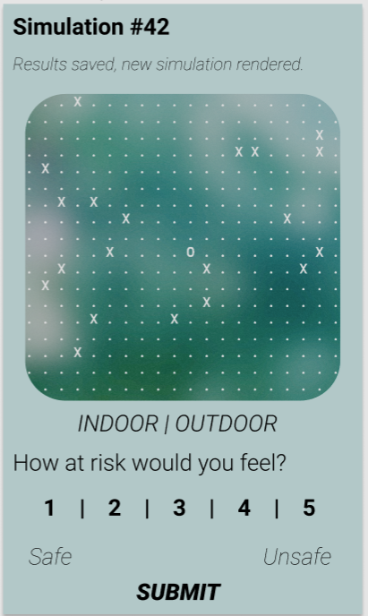

# covid-comfort
A sample application for crowd-sourced congestion detection in public spaces.

## Files

Description of files in their current state.

## simple_survey.py

Generates up to `MAX_NODES` random positions representing unfamiliar persons in a public space with a radius of `MAX_DIST` feet. These parameters can be configured at the top of the script.

Displays these positions to the user within the terminal using `print_simulation`. Then prompts the user to select a risk between 1 and 5.

Stores distances, positions, and various statistics (minumum distance, arithmetic/geometric/quadratic means of the distance) as _features_ and the user-inputted risk value as the _label_ as an entry to the TSV file specified by the `--file` argument when running the script. Subsequent runs will add to this file as long as it's selected.

Script can be exited with _Ctrl + C_ at any time with no harm done to the file.

### Usage
`python simple_survey.py --file [selected TSV file]`

In the 'rendered' simulation, 'O' represents the user while 'X' represents unfamiliar persons within their space.

## log.tsv

A sample output file of the survey script. Each entry includes the positions, distances, relevant statistics, and the user-inputted label. Moving forward, database development should be based on this.

If a non-existing file is selected as the argument passed through `--file`, a new file will be created, and the old file will be left alone.

## Creating a Survey App

A survey must be created to obtain initial data. The best platform to do this is via a mobile-focused web app, as it's the most accessible without having to port to different platforms.

## Frontend

A baseline interface for a survey application. It includes:
* *simulation round*: to allow users to keep track of how many data points they've generated in the session
* *status*: if results have been saved, new images rendered, this is quite flexible really
* *scenario display*: displays the randomly generated scenario to the user; hopefully it looks more aesthetic than this sample terminal output display
* *settings indicator*: whether this scenario takes place indoors or outdoors _(Note: this isn't included the CLI prototype)_
* *user prompt*: to select a risk value between 1-5
* *submission*: to generate an entry for the backend

In the package.json we configured a port 5000 proxy to point to our Flask backend. With this we can focus on working with the default port 3000 since it will be forward to 5000.
We also added two scripts *start-backend-win* and *start-backend-posix*, which start the backend on windows and posix OSs respectively.

## Backend
Backend structure should resemble the sample TSV file, with the addition of the indoor/outdoor setting.

## Build
yarn==1.22.4
npm==6.14.4